<!--
  Profile README for github.com/ddd3h
  Animated assets live in ./assets and are generated by ./scripts/build_svgs.py
  assets/stats.svg is refreshed daily by .github/workflows/stats.yml
-->

 

  

 

<table align="center">
<tr>
<td>

- 🚀 &nbsp;**CTO & Rocket Development Lead** — [Chart Inc.](https://www.ddd3h.com/) *(2024 – present)*
- 🔭 &nbsp;**Ph.D. student, Astrophysics** — Cosmic Evolution Group (OUTAP), The University of Osaka
- 🛰️ &nbsp;Shipping **avionics, telemetry links, ground stations** and the **simulations** that design them
- 🧮 &nbsp;Running **cosmological & fluid simulations** on supercomputers; **HPC** and **cluster** tuning
- 🔐 &nbsp;**Full-stack** engineer with a **security** mindset — from bare-metal C to Next.js
- 📍 &nbsp;Osaka, Japan &nbsp;·&nbsp; 🇯🇵 Japanese (native) &nbsp;·&nbsp; 🇬🇧 English (professional)

</td>
</tr>
</table>

## 🛰️ Mission Domains

## ⚙️ Tech Arsenal

<table>
<tr>
<td align="right"><b>Languages</b></td>
<td></td>
</tr>
<tr>
<td align="right"><b>Frontend</b></td>
<td></td>
</tr>
<tr>
<td align="right"><b>Backend & Data</b></td>
<td></td>
</tr>
<tr>
<td align="right"><b>Science & ML</b></td>
<td>
&nbsp;

</td>
</tr>
<tr>
<td align="right"><b>Infra & Tools</b></td>
<td>
&nbsp;
</td>
</tr>
<tr>
<td align="right"><b>Hardware</b></td>
<td>
&nbsp;

</td>
</tr>
</table>

## 🚀 Featured Missions

<table align="center">
<tr>
<td width="33%" valign="top">
<b>🛰️ <a href="https://github.com/ddd3h/AetherLink">AetherLink</a></b> 
Modern ground-station GUI for open, extensible telemetry visualization.  

</td>
<td width="33%" valign="top">
<b>🚀 <a href="https://github.com/ddd3h/ignisyeet">IgnisYeet</a></b> 
6-DOF rocket flight simulator with leapfrog integration and ECEF / geodetic output.  

</td>
<td width="33%" valign="top">
<b>🌊 <a href="https://github.com/ddd3h/ff-room">ff-room</a></b> 
3-D indoor airflow CFD: incompressible Navier–Stokes with Chorin projection on a MAC grid.  

</td>
</tr>
<tr>
<td width="33%" valign="top">
<b>🌌 <a href="https://github.com/ddd3h/nbody-collapse-hdf5">nbody-collapse-hdf5</a></b> 
N-body gravitational collapse with HDF5 snapshot storage; cross-platform Makefile build.  

</td>
<td width="33%" valign="top">
<b>📡 <a href="https://github.com/ddd3h/GrandGUI">GrandGUI</a></b> 
Real-time UART telemetry dashboard — map, charts and status widgets, config-driven frame formats.  

</td>
<td width="33%" valign="top">
<b>🎈 <a href="https://github.com/ddd3h/Falling-position-simulator2026">Falling-position-simulator</a></b> 
High-altitude balloon landing prediction with Monte Carlo distributions and launch-condition optimization.  

</td>
</tr>
<tr>
<td width="33%" valign="top">
<b>🔲 <a href="https://github.com/ddd3h/systolic-mac-sim">systolic-mac-sim</a></b> 
Cycle-accurate systolic MAC-array GEMM simulator with design-space exploration, a pre-RTL proving ground.  

</td>
<td width="33%" valign="top">
<b>🔍 <a href="https://github.com/ddd3h/ScopeFind">ScopeFind</a></b> 
Incremental TUI code search for huge research trees; runs over SSH on supercomputers.  

</td>
<td width="33%" valign="top">
<b>🦀 <a href="https://github.com/ddd3h/rs-pi">rs-pi</a></b> 
Arbitrary-precision π via the Chudnovsky algorithm, the method behind world-record digit counts.  

</td>
</tr>
</table>

## 🔭 Research

- **CROCODILE** — cosmological hydrodynamic simulations: AGN feedback and circumgalactic-medium metallicity with top-heavy IMF models.
  📄 *Cosmic Himalayas in CROCODILE: Probing the Extreme Quasar Overdensities by Count-in-Cells Analysis and Nearest Neighbor Distribution* (2025) — [doi:10.3847/1538-4357/ae5798](https://doi.org/10.3847/1538-4357/ae5798)
- **ANCO-project** — stratospheric balloon payloads with real-time image transfer over **LoRa**, custom GUI telemetry, radiation measurements. Communications team lead.
- **CORE / HIBARI** — hybrid rocket and CanSat programs: simulation, electronics, recovery system design.
- Member, Japanese Astronomical Society · Committee member, Ehime Nanyo & Japan–Mongolia joint balloon experiments.

## 📡 Telemetry

 

  

<picture>
  <source media="(prefers-color-scheme: dark)" srcset="https://raw.githubusercontent.com/ddd3h/ddd3h/output/github-snake-dark.svg" />
  <source media="(prefers-color-scheme: light)" srcset="https://raw.githubusercontent.com/ddd3h/ddd3h/output/github-snake.svg" />
  
</picture>

 

  

